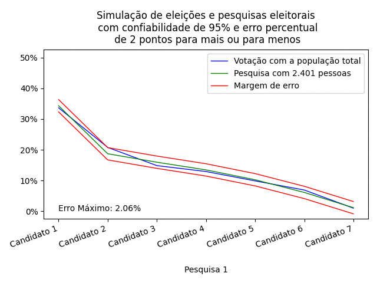

# Statistical Opinion Survey Simulator

    

This is a small tool for creating simulations of opinion surveys. See the `example_animated.py`, `example_diabetes.ipynb`, `example_election.ipynb` and `example_prop_ic_size.ipynb` to see examples of how to **statistical opinion survey simulator** works.
